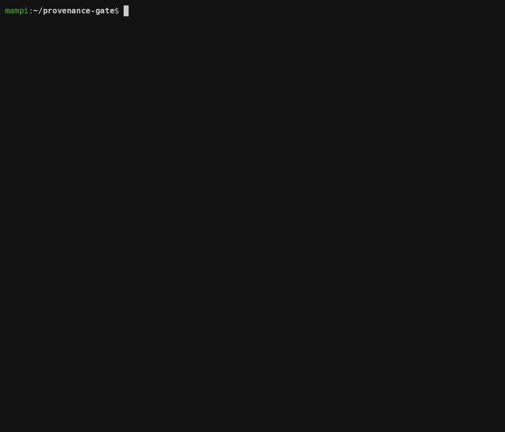
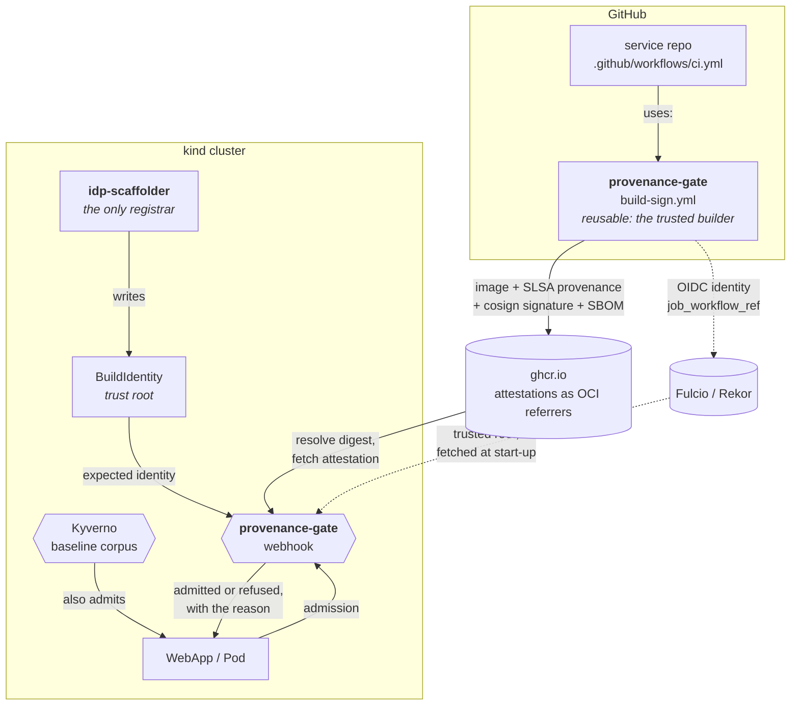

# provenance-gate

**Admission control that ties a Kubernetes workload to the build that produced
it.**

Not "this image is signed". *This image was built by the workflow that belongs
to this service*, checked against a trust root the workload itself cannot write.

[](https://github.com/Mampiz/provenance-gate/actions/workflows/ci.yml)
[](https://github.com/Mampiz/provenance-gate/actions/workflows/e2e.yml)
[](https://github.com/Mampiz/provenance-gate/actions/workflows/e2e-provenance.yml)
[](https://github.com/Mampiz/provenance-gate/actions/workflows/release.yml)
[](LICENSE)

---

## What this demonstrates



Three admissions, run against images this repository really publishes, by
[`make verify-f3`](infra/scripts/verify-f3.sh):

| Image | Signature | Outcome |
|---|---|---|
| built by this service's own workflow | genuine | **admitted** |
| no attestation at all | none | **rejected** |
| built by a different workflow, same trusted builder | **genuine** | **rejected** |

The third row is the entire point. That image is not a forgery. It was built by
the same reusable workflow, signed keyless with a real GitHub OIDC identity,
recorded in the public transparency log, and it is refused:

```
image was built by workflow ".github/workflows/testdata.yml",
but this workload requires ".github/workflows/release.yml"
```

A control that only rejects unsigned images tells you nothing you did not
already know. A control that rejects a genuinely signed image because the build
does not belong to that workload is the one worth having.

## Why a webhook, and not just Kyverno

This section used to make a claim that turned out to be false, and correcting it
is more interesting than the claim was.

The original argument was that Kyverno could verify signatures but could not
express "the provenance must name the repository *this specific resource*
declares", because the expected identity lives in the policy rather than in the
object being admitted.

That was tested before any of the webhook was written, and on Kyverno 1.19 it
does not hold. Its `ImageValidatingPolicy` has `object` in scope,
`extractPayload` for the in-toto predicate, `subjectExpression` for a
per-resource expected signer, and `resource.Get` for arbitrary cluster lookups.
The comparison fits in nine lines of YAML.
[`docs/decisions/evidence/kyverno-cel-probe.sh`](docs/decisions/evidence/kyverno-cel-probe.sh)
reproduces the finding.

So the boundary moved, and this is where it actually falls:

**Kyverno is the enforcement engine.** The general policy corpus lives there:
mutable tags, `runAsNonRoot`, requests and limits, `privileged`, `hostPath`.
Nothing in this repository reimplements any of it.

**What Kyverno cannot do is be the source of truth.** `resource.Get` *reads* a
trust root. It does not create one, keep it in step with the platform that
scaffolds services, or stop the wrong person writing to it. Those are the
questions that decide whether the check means anything:

1. **Where does the expected build identity come from?** An annotation on the
   resource is self-asserted. Anyone who can create the workload can write the
   annotation, point it at a repository they own, build a genuinely signed image
   there, and pass. A check whose expected value is supplied by the thing being
   checked is not a check.
2. **Who may write it?** `BuildIdentity` is a separate object with its own RBAC.
   `provenance-gate-registrar` is bound to the platform's ServiceAccount and to
   nobody else, including the owner of the service it describes.
3. **Who keeps it true?** Services get renamed, repositories move, default
   branches change. A stale trust root either blocks a legitimate deploy or, far
   worse, keeps trusting a repository that no longer belongs to that service.

This project builds the trust registry and enforces against it. The full
reasoning, including what the old argument got wrong, is in
[ADR 0007](docs/decisions/0007-the-boundary-with-kyverno-was-wrong.md).

## Secure boot, one layer up

> **Draft.** The technical parallel below is mine; the experience it is drawing
> on is not. Josep, this section is a placeholder for you to rewrite from what
> you actually did at NXP and TTTech. Nothing here claims any specific detail
> about that work, and it should not ship until you have replaced it.

Secure boot solves one problem, stated carefully: **nothing executes until
something already trusted has verified it.**

The mechanism is a chain, and every link is the same shape. A root of trust
that cannot be rewritten by what it verifies. A signature over an immutable
artifact, not over a name that can be repointed. A verification that happens
*before* execution rather than after. And a failure that stops the boot rather
than logging and continuing.

A container platform has all four problems and, by default, solves none of them:

| Secure boot | This project |
|---|---|
| Immutable ROM holds the root of trust | `BuildIdentity`, writable only by the platform's ServiceAccount |
| Each stage verifies the next before jumping to it | Admission verifies the image before the kubelet pulls it |
| The signature covers a specific image, by hash | The attestation covers a digest; the tag is resolved first and never trusted |
| A failed check halts the boot | `failurePolicy` refuses the workload |

Two differences are worth naming rather than glossing over. A bootloader's root
of trust is physically immutable; ours is a Kubernetes object, and it is only as
strong as the RBAC around it, which is why that RBAC gets its own section
rather than a footnote. And a boot chain verifies once, at a moment when nothing
else is running; admission verifies continuously, under load, with a timeout,
which is why [the numbers](docs/benchmarks.md) are part of the argument and not
an appendix.

## Where it fits

Two projects this plugs into, neither of which it modifies:

- **[webapp-operator](https://github.com/Mampiz/webapp-operator)** owns the
  `WebApp` custom resource. It already refuses mutable image tags. This adds the
  question that comes after "is the tag pinned": *who built it*.
- **[idp-backstage](https://github.com/Mampiz/idp-backstage)** scaffolds a
  service, its repository and its CI. It becomes the registrar: the only writer
  of the trust roots. [`integration/idp-backstage/`](integration/idp-backstage/)
  carries the three changes that takes, written out rather than applied, because
  this repository does not own that one.

`make verify-f4` runs the whole path: a `WebApp` on its own service's image is
admitted and the operator reconciles it into pods that are admitted too; the
same `WebApp` on a Docker Hub image is refused; the same `WebApp` on a genuinely
signed image from another workflow is refused for the workflow.


## How the chain is built



The build lives in a **reusable workflow**, and that is what makes the claim
SLSA Build L3 rather than L2. The OIDC token GitHub issues carries
`job_workflow_ref` pointing at `build-sign.yml`, so the signing identity is the
builder, not the repository being built. A service cannot change how its own
artifact is produced without changing this repository.

## Running it

```bash
make preflight    # host limits kind needs, checked before anything is created
make bootstrap    # kind + cert-manager + Kyverno + the policy corpus, from zero
make deploy       # build the webhook, load it into kind, install it

make verify-f0    # the cluster baseline
make verify-f1    # the published image's provenance, signature and SBOM
make verify-f2    # the Kyverno corpus, Audit then Deny
make verify-f3    # the three cases
make verify-f4    # the WebApp path, end to end
make benchmark    # regenerate docs/benchmarks.md

make help         # every target
```

Every `kubectl` call pins `--context`, and every verifier refuses to run against
an API server that is not local.

Anyone can check the published image without cloning anything:

```bash
cosign verify \
  --certificate-identity https://github.com/Mampiz/provenance-gate/.github/workflows/build-sign.yml@refs/heads/main \
  --certificate-oidc-issuer https://token.actions.githubusercontent.com \
  ghcr.io/mampiz/provenance-gate:<tag>
```

## What it costs

Measured, not estimated, and reproducible with `make benchmark`:

| | p50 | p95 |
|---|--:|--:|
| admission, cache warm | 0.6 ms | 1.0 ms |
| admission, cache cold | ~570 ms | 1 s to 5 s |

Signature verification is about 3 ms of that. The rest is the registry. The
first version of this took 5.5 s at p50 and would have timed out on every cold
admission; splitting the stages showed three registry calls each negotiating
their own bearer token, and sharing one client fixed it.

The cold p95 still crosses the 4 s admission timeout on a slow link, which is
why `failurePolicy` is still `Ignore` and why that is written down as a debt
rather than presented as a choice. Full figures and the argument in
[docs/benchmarks.md](docs/benchmarks.md).

## Documentation

| | |
|---|---|
| [Getting started](docs/getting-started.md) | Run it locally, and guard a namespace of your own |
| [Architecture](docs/architecture.md) | The four pieces and which one owns what |
| [Troubleshooting](docs/troubleshooting.md) | The failures you will actually hit |
| [Numbers](docs/benchmarks.md) | Latency, memory and coverage, and what measuring changed |
| [Design decisions](docs/decisions/README.md) | Ten records, including the one that says an earlier one was wrong |
| [IDP integration](integration/idp-backstage/README.md) | What the platform has to change, and why the order matters |
| [Build log](PROGRESS.md) | The phase graph and what each verifier proves |
| [Contributing](CONTRIBUTING.md) | Layout, verifiers, and the one change that gets rejected |
| [Recordings](docs/assets/README.md) | The GIFs, their sources, and how to re-record them |

## License

Apache-2.0. See [LICENSE](LICENSE).
